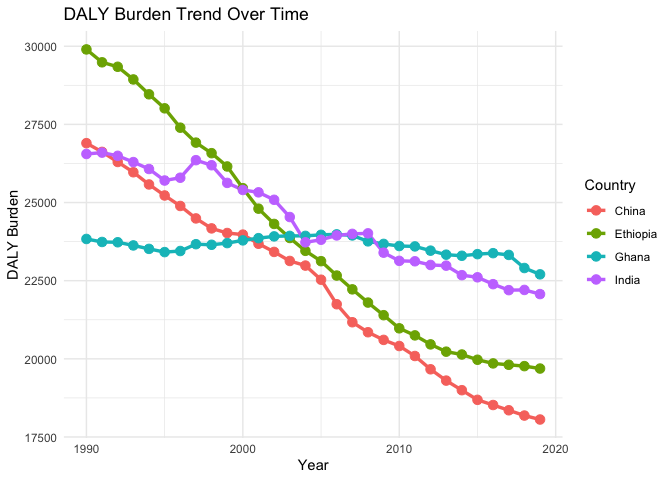
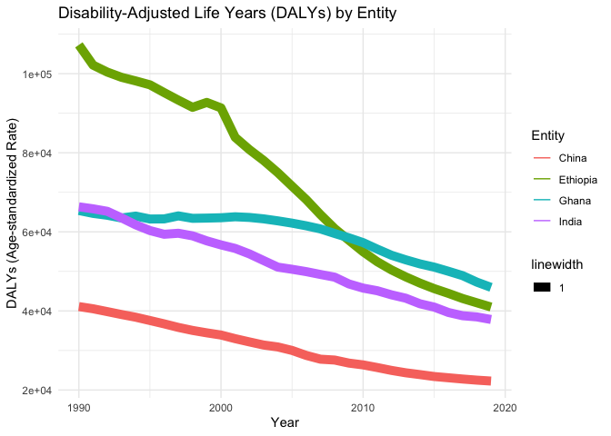

Global Disease Burden Analysis
================
REPLACE WITH THE AUTHOR NAMES

# Introduction

This document compares the Disability-Adjusted Life Year (DALY) diseases
burden for three countries: COUNTRY 1, COUNTRY 2, and COUNTRY 3. We
compare the burden due to communicable, maternal, neonatal, and
nutritional diseases (CMNN), non-communicable diseases (NCDs), and
overall disease burden for these countries.

The source data is from the Institute for Health Metrics and Evaluation
(IHME) Global Burden of Disease (GBD) study.

# Communicable, Maternal, Neonatal, and Nutritional Disease Burden (CMNN)

## Table of Estimates for CMNN Burden Over Time

## Plot Showing Trends in CMNN Burden Over Time

## Summary of CMNN Burden Findings

Provide a brief analysis based on the data presented in the table and
chart. Highlight any significant findings or patterns. About 3
sentences.

    ## # A tibble: 5 × 4
    ##   Entity      Code   Year DALYs (Disability-Adjusted Life Years) - Non-communi…¹
    ##   <chr>       <chr> <dbl>                                                  <dbl>
    ## 1 Afghanistan AFG    1990                                                 41789.
    ## 2 Afghanistan AFG    1991                                                 40756.
    ## 3 Afghanistan AFG    1992                                                 40117.
    ## 4 Afghanistan AFG    1993                                                 40402.
    ## 5 Afghanistan AFG    1994                                                 40826.
    ## # ℹ abbreviated name:
    ## #   ¹​`DALYs (Disability-Adjusted Life Years) - Non-communicable diseases - Sex: Both - Age: Age-standardized (Rate)`

# Filtering the necessary dataset

Non-Communicable Disease Burden (NCD)： India,China,Ghana, Ethiopia

# Table of Estimates for NCD Burden Over Time

| Code | Year |    China | Ethiopia |    Ghana |    India |
|:-----|-----:|---------:|---------:|---------:|---------:|
| CHN  | 1990 | 26899.54 |     0.00 |     0.00 |     0.00 |
| CHN  | 1991 | 26620.36 |     0.00 |     0.00 |     0.00 |
| CHN  | 1992 | 26298.02 |     0.00 |     0.00 |     0.00 |
| CHN  | 1993 | 25968.73 |     0.00 |     0.00 |     0.00 |
| CHN  | 1994 | 25578.53 |     0.00 |     0.00 |     0.00 |
| CHN  | 1995 | 25225.82 |     0.00 |     0.00 |     0.00 |
| CHN  | 1996 | 24890.40 |     0.00 |     0.00 |     0.00 |
| CHN  | 1997 | 24492.28 |     0.00 |     0.00 |     0.00 |
| CHN  | 1998 | 24173.12 |     0.00 |     0.00 |     0.00 |
| CHN  | 1999 | 24025.06 |     0.00 |     0.00 |     0.00 |
| CHN  | 2000 | 23974.24 |     0.00 |     0.00 |     0.00 |
| CHN  | 2001 | 23681.81 |     0.00 |     0.00 |     0.00 |
| CHN  | 2002 | 23420.51 |     0.00 |     0.00 |     0.00 |
| CHN  | 2003 | 23131.23 |     0.00 |     0.00 |     0.00 |
| CHN  | 2004 | 22983.46 |     0.00 |     0.00 |     0.00 |
| CHN  | 2005 | 22531.40 |     0.00 |     0.00 |     0.00 |
| CHN  | 2006 | 21746.74 |     0.00 |     0.00 |     0.00 |
| CHN  | 2007 | 21170.78 |     0.00 |     0.00 |     0.00 |
| CHN  | 2008 | 20850.75 |     0.00 |     0.00 |     0.00 |
| CHN  | 2009 | 20605.98 |     0.00 |     0.00 |     0.00 |
| CHN  | 2010 | 20410.24 |     0.00 |     0.00 |     0.00 |
| CHN  | 2011 | 20090.72 |     0.00 |     0.00 |     0.00 |
| CHN  | 2012 | 19665.65 |     0.00 |     0.00 |     0.00 |
| CHN  | 2013 | 19303.81 |     0.00 |     0.00 |     0.00 |
| CHN  | 2014 | 18996.79 |     0.00 |     0.00 |     0.00 |
| CHN  | 2015 | 18688.31 |     0.00 |     0.00 |     0.00 |
| CHN  | 2016 | 18522.67 |     0.00 |     0.00 |     0.00 |
| CHN  | 2017 | 18354.48 |     0.00 |     0.00 |     0.00 |
| CHN  | 2018 | 18185.74 |     0.00 |     0.00 |     0.00 |
| CHN  | 2019 | 18058.96 |     0.00 |     0.00 |     0.00 |
| ETH  | 1990 |     0.00 | 29898.41 |     0.00 |     0.00 |
| ETH  | 1991 |     0.00 | 29486.17 |     0.00 |     0.00 |
| ETH  | 1992 |     0.00 | 29343.40 |     0.00 |     0.00 |
| ETH  | 1993 |     0.00 | 28937.71 |     0.00 |     0.00 |
| ETH  | 1994 |     0.00 | 28462.61 |     0.00 |     0.00 |
| ETH  | 1995 |     0.00 | 28014.17 |     0.00 |     0.00 |
| ETH  | 1996 |     0.00 | 27395.15 |     0.00 |     0.00 |
| ETH  | 1997 |     0.00 | 26917.13 |     0.00 |     0.00 |
| ETH  | 1998 |     0.00 | 26579.43 |     0.00 |     0.00 |
| ETH  | 1999 |     0.00 | 26154.17 |     0.00 |     0.00 |
| ETH  | 2000 |     0.00 | 25458.76 |     0.00 |     0.00 |
| ETH  | 2001 |     0.00 | 24804.32 |     0.00 |     0.00 |
| ETH  | 2002 |     0.00 | 24315.75 |     0.00 |     0.00 |
| ETH  | 2003 |     0.00 | 23866.15 |     0.00 |     0.00 |
| ETH  | 2004 |     0.00 | 23455.24 |     0.00 |     0.00 |
| ETH  | 2005 |     0.00 | 23124.48 |     0.00 |     0.00 |
| ETH  | 2006 |     0.00 | 22664.14 |     0.00 |     0.00 |
| ETH  | 2007 |     0.00 | 22222.70 |     0.00 |     0.00 |
| ETH  | 2008 |     0.00 | 21799.94 |     0.00 |     0.00 |
| ETH  | 2009 |     0.00 | 21396.34 |     0.00 |     0.00 |
| ETH  | 2010 |     0.00 | 20976.46 |     0.00 |     0.00 |
| ETH  | 2011 |     0.00 | 20750.25 |     0.00 |     0.00 |
| ETH  | 2012 |     0.00 | 20462.53 |     0.00 |     0.00 |
| ETH  | 2013 |     0.00 | 20229.40 |     0.00 |     0.00 |
| ETH  | 2014 |     0.00 | 20138.48 |     0.00 |     0.00 |
| ETH  | 2015 |     0.00 | 19970.90 |     0.00 |     0.00 |
| ETH  | 2016 |     0.00 | 19853.51 |     0.00 |     0.00 |
| ETH  | 2017 |     0.00 | 19809.50 |     0.00 |     0.00 |
| ETH  | 2018 |     0.00 | 19766.89 |     0.00 |     0.00 |
| ETH  | 2019 |     0.00 | 19689.46 |     0.00 |     0.00 |
| GHA  | 1990 |     0.00 |     0.00 | 23834.64 |     0.00 |
| GHA  | 1991 |     0.00 |     0.00 | 23738.53 |     0.00 |
| GHA  | 1992 |     0.00 |     0.00 | 23729.19 |     0.00 |
| GHA  | 1993 |     0.00 |     0.00 | 23627.99 |     0.00 |
| GHA  | 1994 |     0.00 |     0.00 | 23517.61 |     0.00 |
| GHA  | 1995 |     0.00 |     0.00 | 23414.67 |     0.00 |
| GHA  | 1996 |     0.00 |     0.00 | 23449.32 |     0.00 |
| GHA  | 1997 |     0.00 |     0.00 | 23667.81 |     0.00 |
| GHA  | 1998 |     0.00 |     0.00 | 23648.54 |     0.00 |
| GHA  | 1999 |     0.00 |     0.00 | 23702.79 |     0.00 |
| GHA  | 2000 |     0.00 |     0.00 | 23789.37 |     0.00 |
| GHA  | 2001 |     0.00 |     0.00 | 23860.69 |     0.00 |
| GHA  | 2002 |     0.00 |     0.00 | 23917.47 |     0.00 |
| GHA  | 2003 |     0.00 |     0.00 | 23933.54 |     0.00 |
| GHA  | 2004 |     0.00 |     0.00 | 23933.72 |     0.00 |
| GHA  | 2005 |     0.00 |     0.00 | 23967.60 |     0.00 |
| GHA  | 2006 |     0.00 |     0.00 | 23982.08 |     0.00 |
| GHA  | 2007 |     0.00 |     0.00 | 23947.44 |     0.00 |
| GHA  | 2008 |     0.00 |     0.00 | 23758.24 |     0.00 |
| GHA  | 2009 |     0.00 |     0.00 | 23676.60 |     0.00 |
| GHA  | 2010 |     0.00 |     0.00 | 23608.84 |     0.00 |
| GHA  | 2011 |     0.00 |     0.00 | 23596.51 |     0.00 |
| GHA  | 2012 |     0.00 |     0.00 | 23460.98 |     0.00 |
| GHA  | 2013 |     0.00 |     0.00 | 23332.25 |     0.00 |
| GHA  | 2014 |     0.00 |     0.00 | 23297.30 |     0.00 |
| GHA  | 2015 |     0.00 |     0.00 | 23349.29 |     0.00 |
| GHA  | 2016 |     0.00 |     0.00 | 23380.50 |     0.00 |
| GHA  | 2017 |     0.00 |     0.00 | 23324.08 |     0.00 |
| GHA  | 2018 |     0.00 |     0.00 | 22905.58 |     0.00 |
| GHA  | 2019 |     0.00 |     0.00 | 22702.90 |     0.00 |
| IND  | 1990 |     0.00 |     0.00 |     0.00 | 26554.09 |
| IND  | 1991 |     0.00 |     0.00 |     0.00 | 26596.63 |
| IND  | 1992 |     0.00 |     0.00 |     0.00 | 26494.62 |
| IND  | 1993 |     0.00 |     0.00 |     0.00 | 26294.26 |
| IND  | 1994 |     0.00 |     0.00 |     0.00 | 26072.98 |
| IND  | 1995 |     0.00 |     0.00 |     0.00 | 25704.34 |
| IND  | 1996 |     0.00 |     0.00 |     0.00 | 25794.08 |
| IND  | 1997 |     0.00 |     0.00 |     0.00 | 26355.52 |
| IND  | 1998 |     0.00 |     0.00 |     0.00 | 26193.81 |
| IND  | 1999 |     0.00 |     0.00 |     0.00 | 25628.72 |
| IND  | 2000 |     0.00 |     0.00 |     0.00 | 25402.28 |
| IND  | 2001 |     0.00 |     0.00 |     0.00 | 25326.27 |
| IND  | 2002 |     0.00 |     0.00 |     0.00 | 25087.93 |
| IND  | 2003 |     0.00 |     0.00 |     0.00 | 24536.36 |
| IND  | 2004 |     0.00 |     0.00 |     0.00 | 23726.90 |
| IND  | 2005 |     0.00 |     0.00 |     0.00 | 23809.74 |
| IND  | 2006 |     0.00 |     0.00 |     0.00 | 23947.92 |
| IND  | 2007 |     0.00 |     0.00 |     0.00 | 23997.51 |
| IND  | 2008 |     0.00 |     0.00 |     0.00 | 24014.73 |
| IND  | 2009 |     0.00 |     0.00 |     0.00 | 23396.45 |
| IND  | 2010 |     0.00 |     0.00 |     0.00 | 23134.68 |
| IND  | 2011 |     0.00 |     0.00 |     0.00 | 23120.89 |
| IND  | 2012 |     0.00 |     0.00 |     0.00 | 23002.85 |
| IND  | 2013 |     0.00 |     0.00 |     0.00 | 22981.07 |
| IND  | 2014 |     0.00 |     0.00 |     0.00 | 22676.67 |
| IND  | 2015 |     0.00 |     0.00 |     0.00 | 22608.59 |
| IND  | 2016 |     0.00 |     0.00 |     0.00 | 22389.00 |
| IND  | 2017 |     0.00 |     0.00 |     0.00 | 22197.81 |
| IND  | 2018 |     0.00 |     0.00 |     0.00 | 22204.26 |
| IND  | 2019 |     0.00 |     0.00 |     0.00 | 22071.57 |

| Code | mean_DALY | median_DALY |  std_DALY | min_DALY | max_DALY | n_obs |
|:-----|----------:|------------:|----------:|---------:|---------:|------:|
| CHN  |  22284.87 |    22757.43 | 2836.7802 | 18058.96 | 26899.54 |    30 |
| ETH  |  23864.79 |    23289.86 | 3493.7570 | 19689.46 | 29898.41 |    30 |
| GHA  |  23601.87 |    23658.17 |  304.5552 | 22702.90 | 23982.08 |    30 |
| IND  |  24377.42 |    24006.12 | 1549.3803 | 22071.57 | 26596.63 |    30 |

# Plot Showing Trends in NCD Burden Over Time

    ## Warning: Using `size` aesthetic for lines was deprecated in ggplot2 3.4.0.
    ## ℹ Please use `linewidth` instead.
    ## This warning is displayed once every 8 hours.
    ## Call `lifecycle::last_lifecycle_warnings()` to see where this warning was
    ## generated.

<!-- -->

# Summary of NCD Burden Findings

Provide a brief analysis based on the data presented in the table and
chart. Highlight any significant findings or patterns. About 3
sentences. 1 Table: data_ncd_summary shows that the largest mean_DALY is
in India, the largest DALYs are found in Ethiopia 29898.41, and the
smallest DALYs are found in China 18058.96 2 Figure: It can be seen that
DALYs of all the five countries have shown a significant decline in 30
years, indicating an improvement in health status. The faster rate of
decline is seen in Ethiopia and China and the slower change is seen in
Ghana and India. 3 The mean and median DALYs of these four countries are
very close to each other but differ in standard deviation, which
reflects the dispersion of the data. Ethiopia’s DALY value has the
largest standard deviation, indicating that its data has the highest
variability among the four countries. Ghana, on the other hand, has the
smallest standard deviation of DALY values, indicating that its data are
the most stable among the four countries.

From the finding we observe that China and Ethiopia has shown a
remarkable decline in the DALY from 1990 to 2020. On the other hand,
Ghana has shown a steady change over tthe specified period. Among the
four country, the maximum DALY value was seen by Ethiopians In the late
time back in 1990 while the min is by Chinese in 2020.

# Overall Disease Burden

    ## # A tibble: 6 × 4
    ##   Entity      Code   Year DALYs (Disability-Adjusted Life Years) - All causes …¹
    ##   <chr>       <chr> <dbl>                                                  <dbl>
    ## 1 Afghanistan AFG    1990                                                 86375.
    ## 2 Afghanistan AFG    1991                                                 83381.
    ## 3 Afghanistan AFG    1992                                                 79891.
    ## 4 Afghanistan AFG    1993                                                 80293.
    ## 5 Afghanistan AFG    1994                                                 83335.
    ## 6 Afghanistan AFG    1995                                                 82236.
    ## # ℹ abbreviated name:
    ## #   ¹​`DALYs (Disability-Adjusted Life Years) - All causes - Sex: Both - Age: Age-standardized (Rate)`

## Table of Estimates for Overall Disease Burden Over Time

| Year | DALY/China | DALY/Ethiopia | DALY/Ghana | DALY/India |
|-----:|-----------:|--------------:|-----------:|-----------:|
| 1990 |   41104.86 |            NA |         NA |         NA |
| 1991 |   40551.56 |            NA |         NA |         NA |
| 1992 |   39829.43 |            NA |         NA |         NA |
| 1993 |   39095.75 |            NA |         NA |         NA |
| 1994 |   38415.05 |            NA |         NA |         NA |
| 1995 |   37580.07 |            NA |         NA |         NA |
| 1996 |   36737.94 |            NA |         NA |         NA |
| 1997 |   35836.49 |            NA |         NA |         NA |
| 1998 |   35074.60 |            NA |         NA |         NA |
| 1999 |   34463.01 |            NA |         NA |         NA |
| 2000 |   33911.00 |            NA |         NA |         NA |
| 2001 |   32987.51 |            NA |         NA |         NA |
| 2002 |   32168.63 |            NA |         NA |         NA |
| 2003 |   31380.48 |            NA |         NA |         NA |
| 2004 |   30893.73 |            NA |         NA |         NA |
| 2005 |   30015.43 |            NA |         NA |         NA |
| 2006 |   28751.86 |            NA |         NA |         NA |
| 2007 |   27800.58 |            NA |         NA |         NA |
| 2008 |   27581.45 |            NA |         NA |         NA |
| 2009 |   26813.15 |            NA |         NA |         NA |
| 2010 |   26356.70 |            NA |         NA |         NA |
| 2011 |   25683.30 |            NA |         NA |         NA |
| 2012 |   24959.31 |            NA |         NA |         NA |
| 2013 |   24361.11 |            NA |         NA |         NA |
| 2014 |   23902.60 |            NA |         NA |         NA |
| 2015 |   23418.00 |            NA |         NA |         NA |
| 2016 |   23101.30 |            NA |         NA |         NA |
| 2017 |   22783.52 |            NA |         NA |         NA |
| 2018 |   22501.90 |            NA |         NA |         NA |
| 2019 |   22270.51 |            NA |         NA |         NA |
| 1990 |         NA |     107283.27 |         NA |         NA |
| 1991 |         NA |     102162.99 |         NA |         NA |
| 1992 |         NA |     100404.10 |         NA |         NA |
| 1993 |         NA |      99084.13 |         NA |         NA |
| 1994 |         NA |      98170.03 |         NA |         NA |
| 1995 |         NA |      97185.80 |         NA |         NA |
| 1996 |         NA |      95218.18 |         NA |         NA |
| 1997 |         NA |      93312.77 |         NA |         NA |
| 1998 |         NA |      91492.19 |         NA |         NA |
| 1999 |         NA |      92732.75 |         NA |         NA |
| 2000 |         NA |      91348.66 |         NA |         NA |
| 2001 |         NA |      83895.90 |         NA |         NA |
| 2002 |         NA |      80792.69 |         NA |         NA |
| 2003 |         NA |      78052.67 |         NA |         NA |
| 2004 |         NA |      74958.30 |         NA |         NA |
| 2005 |         NA |      71546.76 |         NA |         NA |
| 2006 |         NA |      68154.33 |         NA |         NA |
| 2007 |         NA |      64350.78 |         NA |         NA |
| 2008 |         NA |      60823.98 |         NA |         NA |
| 2009 |         NA |      57870.03 |         NA |         NA |
| 2010 |         NA |      54961.36 |         NA |         NA |
| 2011 |         NA |      52436.59 |         NA |         NA |
| 2012 |         NA |      50364.47 |         NA |         NA |
| 2013 |         NA |      48614.93 |         NA |         NA |
| 2014 |         NA |      47041.12 |         NA |         NA |
| 2015 |         NA |      45645.59 |         NA |         NA |
| 2016 |         NA |      44442.22 |         NA |         NA |
| 2017 |         NA |      43145.65 |         NA |         NA |
| 2018 |         NA |      42065.48 |         NA |         NA |
| 2019 |         NA |      40990.33 |         NA |         NA |
| 1990 |         NA |            NA |   65403.59 |         NA |
| 1991 |         NA |            NA |   64671.89 |         NA |
| 1992 |         NA |            NA |   64200.04 |         NA |
| 1993 |         NA |            NA |   63507.64 |         NA |
| 1994 |         NA |            NA |   63989.91 |         NA |
| 1995 |         NA |            NA |   63252.55 |         NA |
| 1996 |         NA |            NA |   63277.94 |         NA |
| 1997 |         NA |            NA |   64038.00 |         NA |
| 1998 |         NA |            NA |   63422.87 |         NA |
| 1999 |         NA |            NA |   63481.72 |         NA |
| 2000 |         NA |            NA |   63569.57 |         NA |
| 2001 |         NA |            NA |   63813.70 |         NA |
| 2002 |         NA |            NA |   63646.88 |         NA |
| 2003 |         NA |            NA |   63290.82 |         NA |
| 2004 |         NA |            NA |   62780.86 |         NA |
| 2005 |         NA |            NA |   62204.93 |         NA |
| 2006 |         NA |            NA |   61533.66 |         NA |
| 2007 |         NA |            NA |   60739.70 |         NA |
| 2008 |         NA |            NA |   59592.35 |         NA |
| 2009 |         NA |            NA |   58495.99 |         NA |
| 2010 |         NA |            NA |   57274.76 |         NA |
| 2011 |         NA |            NA |   55630.43 |         NA |
| 2012 |         NA |            NA |   54077.98 |         NA |
| 2013 |         NA |            NA |   52929.39 |         NA |
| 2014 |         NA |            NA |   51901.16 |         NA |
| 2015 |         NA |            NA |   51084.94 |         NA |
| 2016 |         NA |            NA |   50030.63 |         NA |
| 2017 |         NA |            NA |   48932.66 |         NA |
| 2018 |         NA |            NA |   47288.63 |         NA |
| 2019 |         NA |            NA |   45965.32 |         NA |
| 1990 |         NA |            NA |         NA |   66331.86 |
| 1991 |         NA |            NA |         NA |   65830.74 |
| 1992 |         NA |            NA |         NA |   65195.09 |
| 1993 |         NA |            NA |         NA |   63540.49 |
| 1994 |         NA |            NA |         NA |   61770.56 |
| 1995 |         NA |            NA |         NA |   60328.05 |
| 1996 |         NA |            NA |         NA |   59392.84 |
| 1997 |         NA |            NA |         NA |   59647.16 |
| 1998 |         NA |            NA |         NA |   58990.25 |
| 1999 |         NA |            NA |         NA |   57725.99 |
| 2000 |         NA |            NA |         NA |   56700.43 |
| 2001 |         NA |            NA |         NA |   55810.22 |
| 2002 |         NA |            NA |         NA |   54426.49 |
| 2003 |         NA |            NA |         NA |   52742.33 |
| 2004 |         NA |            NA |         NA |   51078.22 |
| 2005 |         NA |            NA |         NA |   50537.78 |
| 2006 |         NA |            NA |         NA |   49940.44 |
| 2007 |         NA |            NA |         NA |   49223.80 |
| 2008 |         NA |            NA |         NA |   48542.66 |
| 2009 |         NA |            NA |         NA |   46831.44 |
| 2010 |         NA |            NA |         NA |   45779.16 |
| 2011 |         NA |            NA |         NA |   45108.60 |
| 2012 |         NA |            NA |         NA |   44068.44 |
| 2013 |         NA |            NA |         NA |   43223.26 |
| 2014 |         NA |            NA |         NA |   41814.78 |
| 2015 |         NA |            NA |         NA |   40978.04 |
| 2016 |         NA |            NA |         NA |   39614.92 |
| 2017 |         NA |            NA |         NA |   38790.55 |
| 2018 |         NA |            NA |         NA |   38497.58 |
| 2019 |         NA |            NA |         NA |   37843.33 |

## Plot Showing Trends in Overall Disease Burden Over Time

<!-- -->
\`\`\`

## Summary of Overall Disease Burden Findings

China has the lowest DALY overtime and Ethiopia recorded the highest
DALY overtime. It is also observed that all the four country’s DALY
declined steadily overtime with Ethiopia having the steepest decline.
